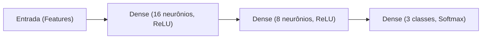

# 🧠 Classificação de Desempenho Estudantil com Redes Neurais (MLP)

[](https://www.python.org/)
[](https://www.tensorflow.org/)
[](https://scikit-learn.org/)
[](https://pandas.pydata.org/)
[](https://www.kaggle.com/datasets/aljarah/xAPI-Edu-Data)

Projeto de aprendizado de máquina focado na predição do nível acadêmico de estudantes a partir de dados comportamentais e de engajamento em ambientes virtuais de aprendizagem (LMS/VLE). O modelo é baseado em uma **Rede Neural Artificial Perceptron Multicamadas (MLP)**, com uma abordagem comparativa entre **subgrupos de gênero (Feminino vs. Masculino)**.

---

## 📌 Sumário
- [Visão Geral](#-visão-geral)
- [Base de Dados](#-base-de-dados)
- [Pipeline de Machine Learning](#-pipeline-de-machine-learning)
- [Arquitetura da Rede Neural (MLP)](#-arquitetura-da-rede-neural-mlp)
- [Estrutura do Repositório](#-estrutura-do-repositório)
- [Como Executar o Projeto](#-como-executar-o-projeto)
  - [Opção 1: Linha de Comando (Script Python)](#opção-1-linha-de-comando-script-python)
  - [Opção 2: Jupyter Notebook ou Google Colab](#opção-2-jupyter-notebook-ou-google-colab)
- [Como Enviar as Alterações para o GitHub](#-como-enviar-as-alterações-para-o-github)
- [Autor(a)](#-autora)

---

## 🎯 Visão Geral

Identificar precocemente estudantes em risco de baixo rendimento é fundamental para intervenções pedagógicas eficazes. Este projeto utiliza o histórico de interação de alunos (levantamento de mãos em aula, visualização de recursos, participação em fóruns de discussão e presença) para categorizá-los em três níveis de rendimento:
- **Alto (H)**
- **Médio (M)**
- **Baixo / Risco (L)**

O diferencial do estudo é a divisão dos dados em subpopulações com base no gênero (`Feminino` e `Masculino`), treinando e avaliando modelos de forma segmentada para analisar a capacidade de generalização e potenciais divergências de comportamento preditivo entre os grupos.

---

## 📊 Base de Dados

O conjunto de dados utilizado é o [xAPI-Edu-Data](https://www.kaggle.com/datasets/aljarah/xAPI-Edu-Data), disponibilizado no Kaggle. O dataset contém registros de alunos coletados por um sistema de rastreamento de aprendizagem (xAPI).

### Principais Atributos:
- **Demográficos**: Nacionalidade, local de nascimento, série/nível escolar, gênero.
- **Engajamento & Interação**:
  - `raisedhands`: Quantidade de vezes que o aluno levantou a mão na aula.
  - `VisITedResources`: Frequência de acesso a materiais e conteúdos.
  - `AnnouncementsView`: Número de visualizações de avisos da escola.
  - `Discussion`: Participação em tópicos de discussão/fóruns.
- **Comportamentais / Frequência**: Dias de ausência (`StudentAbsenceDays`), satisfação dos responsáveis (`ParentAnsweringSurvey`), entre outros.
- **Variável-Alvo (`Class`)**:
  - `Alto`: Notas entre 90 e 100
  - `Medio`: Notas entre 70 e 89
  - `Baixo (Risco)`: Notas abaixo de 69

---

## ⚙️ Pipeline de Machine Learning

1. **Carregamento Automático**:
   - Integração com a biblioteca `kagglehub` para download automatizado da versão mais recente do dataset (com suporte a fallback local).
2. **Pré-Processamento**:
   - Mapeamento e tradução das classes-alvo.
   - Remoção de variáveis não preditoras e divisão em subgrupos (`df_feminino` e `df_masculino`).
   - **One-Hot Encoding** para atributos categóricos preditores (`pd.get_dummies`).
   - **One-Hot Encoding** na variável-alvo multiclasse (`OneHotEncoder`).
   - **Estratificação na Divisão Treino/Teste**: Proporção 80% treino / 20% teste mantendo a distribuição original das classes.
   - **Normalização Padronizada (Z-score)**: Ajuste com `StandardScaler` nos dados de treino e transformação nos dados de teste para acelerar a convergência do gradiente.
3. **Treinamento & Validação**:
   - 60 épocas de treinamento com mini-batch size de 16.
   - Divisão de validação interna de 10% durante o ajuste dos pesos.
4. **Métricas de Avaliação**:
   - Histórico de erro de treino e validação (*Loss Curves*).
   - Acurácia global (*Accuracy*).
   - Relatório detalhado de classificação (*Precision*, *Recall*, *F1-Score* ponderado e por classe).
   - Matriz de Confusão visual gerada com `Seaborn`.

---

## 🏗️ Arquitetura da Rede Neural (MLP)

A rede neural foi implementada com **TensorFlow / Keras**:



| Camada | Tipo | Unidades / Neurônios | Função de Ativação |
| :--- | :--- | :--- | :--- |
| **Entrada** | `Input` | $N$ atributos codificados | - |
| **Oculta 1** | `Dense` | 16 | `ReLU` |
| **Oculta 2** | `Dense` | 8 | `ReLU` |
| **Saída** | `Dense` | 3 (Alto, Médio, Baixo) | `Softmax` |

- **Otimizador**: `Adam`
- **Função de Perda**: `categorical_crossentropy`
- **Métrica**: `accuracy`

---

## 📁 Estrutura do Repositório

```text
Redes_Neurais/
├── .gitignore              # Arquivos e pastas ignorados pelo Git
├── requirements.txt        # Dependências do projeto
├── main.py                 # Pipeline completo com exportação de gráficos e relatórios
├── notebook.ipynb          # Notebook interativo (Jupyter / Colab)
├── outputs/                # Gráficos (Loss, Matriz de Confusão) e relatórios gerados
│   └── .gitkeep
└── README.md               # Documentação detalhada do projeto
```

---

## 🚀 Como Executar o Projeto

### Pré-requisitos
- Python 3.9 ou superior instalado.
- Gerenciador de pacotes `pip`.

### 1. Clonar o repositório
```bash
git clone https://github.com/MidhiaQ/Redes_Neurais.git
cd Redes_Neurais
```

### 2. Criar e ativar um ambiente virtual (recomendado)
- **No Linux/macOS:**
  ```bash
  python3 -m venv .venv
  source .venv/bin/activate
  ```
- **No Windows (PowerShell):**
  ```powershell
  python -m venv .venv
  .venv\Scripts\Activate.ps1
  ```

### 3. Instalar as dependências
```bash
pip install -r requirements.txt
```

---

### Opção 1: Linha de Comando (Script Python)
Para executar o pipeline completo e salvar as figuras na pasta `outputs/`:
```bash
python main.py
```

Os seguintes arquivos serão gerados automaticamente na pasta `outputs/`:
- `curva_loss_feminino.png` & `curva_loss_masculino.png`
- `matriz_confusao_feminino.png` & `matriz_confusao_masculino.png`
- `relatorio_feminino.txt` & `relatorio_masculino.txt`

---

### Opção 2: Jupyter Notebook ou Google Colab
Caso prefira rodar interativamente:
1. Abra o arquivo `notebook.ipynb` em seu editor preferido (VS Code, Jupyter Lab) ou faça o upload para o [Google Colab](https://colab.research.google.com/).
2. Execute as células sequencialmente.

---

## 📤 Como Enviar as Alterações para o GitHub

Se você já estiver na pasta do projeto e quiser fazer o commit e push para o repositório remoto:

```bash
# 1. Verificar os arquivos modificados/criados
git status

# 2. Adicionar todos os arquivos ao controle de versão
git add .

# 3. Criar o commit com uma mensagem descritiva
git commit -m "feat: adicionar pipeline da rede neural MLP, notebook e documentação do projeto"

# 4. Enviar para a branch principal (main)
git push -u origin main
```

---

## 👤 Autor(a)

Desenvolvido por **Midhia** ([@MidhiaQ](https://github.com/MidhiaQ)).
Projeto desenvolvido para a disciplina / estudos de **Redes Neurais Artificiais**.
